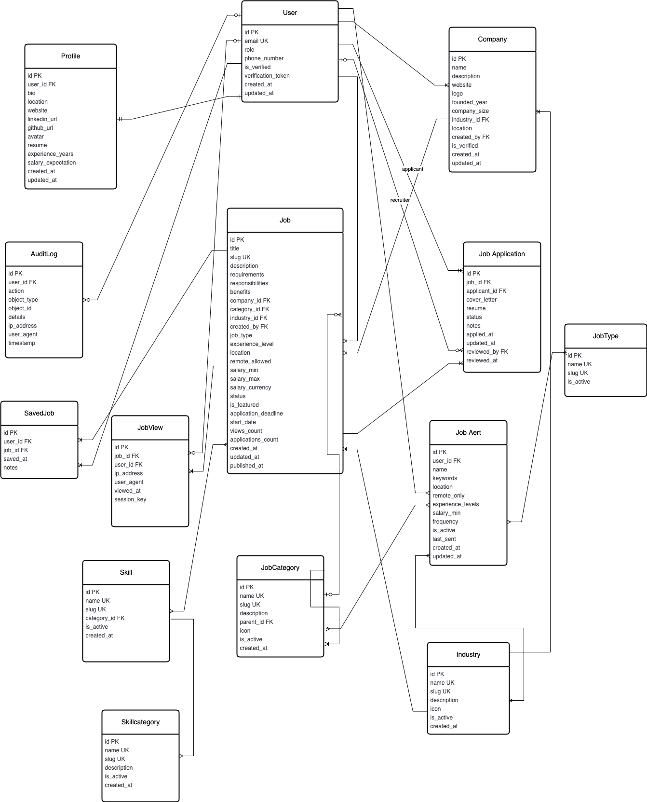

# Job Board Platform ERD - Entity & Relationship Breakdown


This document provides a comprehensive breakdown of the entities, their attributes, relationships, and business logic for a job board platform. The design focuses on scalability, data integrity, and performance optimization.



## 🎯 Core Entities Overview

### 1. **USER** (Central Authentication Entity)

**Purpose**: Core authentication and user management
**Key Attributes**:

- `user` (UUID): Primary key for security and scalability
- `email` (Unique): Login identifier and communication channel
- `role` (Enum): Access control (admin, employer, user)
- `is_verified` (Boolean): Email verification status
- `verification_token`: Security token for account verification

**Business Logic**:

- Serves as the central identity hub for all user interactions
- Enables role-based access control across the platform
- Supports email-based authentication with verification

---

### 2. **PROFILE** (Extended User Information)

**Purpose**: Detailed user information and preferences
**Key Attributes**:

- `bio`, `location`, `website`: Personal/professional information
- `resume`, `avatar`: File uploads for job applications
- `experience_years`, `salary_expectation`: Job matching criteria
- `skills` (Many-to-Many): Technical/professional competencies

**Business Logic**:

- Enhances user profiles for better job matching
- Stores job seeker preferences and qualifications
- Enables personalized job recommendations

**🔗 Relationship with USER**: One-to-One

- **Cardinality**: 1:1 (Each user has exactly one profile)
- **Dependency**: Profile cannot exist without a User
- **Cascade**: Deleting User deletes Profile

---

### 3. **COMPANY** (Employer Organizations)

**Purpose**: Represents organizations posting jobs
**Key Attributes**:

- `name`, `description`: Company identification and branding
- `website`, `logo`: Online presence and visual identity
- `company_size`, `founded_year`: Organizational characteristics
- `location`: Geographic presence
- `is_verified` (Boolean): Trust and credibility indicator

**Business Logic**:

- Provides context and credibility for job postings
- Enables company branding and trust building
- Supports company-based job filtering and search

**🔗 Relationships**:

- **USER (created_by)**: Many-to-One
  - *Cardinality*: N:1 (Multiple companies can be created by one user)
  - *Business Rule*: Only users with 'employer' role can create companies
- **INDUSTRY**: Many-to-One (Optional)
  - *Cardinality*: N:1 (Companies belong to one industry)
  - *Business Rule*: Companies can exist without industry classification

---

### 4. **JOB** (Core Job Posting Entity)

**Purpose**: Central entity representing job opportunities
**Key Attributes**:

- `title`, `slug`: Job identification and URL-friendly naming
- `description`, `requirements`, `responsibilities`: Detailed job information
- `job_type`: Employment type (full-time, part-time, contract, etc.)
- `experience_level`: Required experience (entry, junior, senior, etc.)
- `location`, `remote_allowed`: Geographic and work arrangement options
- `salary_min`, `salary_max`, `salary_currency`: Compensation details
- `status`: Publication status (draft, published, closed, on_hold)
- `application_deadline`: Time-bound applications
- `views_count`, `applications_count`: Engagement metrics

**Business Logic**:

- Central entity connecting employers with job seekers
- Supports comprehensive job filtering and search
- Tracks engagement and application metrics
- Enables salary-based filtering and comparison

**🔗 Relationships**:

- **COMPANY**: Many-to-One
  - *Cardinality*: N:1 (Multiple jobs belong to one company)
  - *Dependency*: Jobs cannot exist without a company
- **USER (created_by)**: Many-to-One
  - *Cardinality*: N:1 (One user can create multiple jobs)
  - *Business Rule*: Only employer/admin roles can create jobs
- **JOBCATEGORY**: Many-to-One (Optional)
  - *Cardinality*: N:1 (Jobs can belong to one category)
- **INDUSTRY**: Many-to-One (Optional)
  - *Cardinality*: N:1 (Jobs can belong to one industry)
- **SKILL**: Many-to-Many
  - *Cardinality*: N:M (Jobs can require multiple skills, skills can be required by multiple jobs)

---

## 📋 Supporting Classification Entities

### 5. **JOBCATEGORY** (Hierarchical Job Classification)

**Purpose**: Organize jobs into logical categories and subcategories
**Key Attributes**:

- `name`, `slug`: Category identification
- `parent` (Self-referencing FK): Hierarchical structure
- `icon`: Visual representation
- `is_active`: Enable/disable categories

**Business Logic**:

- Creates hierarchical job organization (e.g., Technology > Web Development > Frontend)
- Enables category-based filtering and navigation
- Supports dynamic category management

**🔗 Relationships**:

- **Self-referencing**: One-to-Many
  - *Cardinality*: 1:N (Parent category can have multiple subcategories)
  - *Business Rule*: Creates tree-like category structure

### 6. **INDUSTRY** (Business Sector Classification)

**Purpose**: Classify companies and jobs by business sectors
**Key Attributes**:

- `name`, `slug`: Industry identification
- `description`: Detailed industry information
- `icon`: Visual representation

**Business Logic**:

- Enables industry-specific job filtering
- Provides business context for companies and jobs
- Supports market analysis and reporting

### 7. **SKILL & SKILLCATEGORY** (Competency Management)

**Purpose**: Manage technical and professional skills
**Key Attributes**:

- **Skill**: `name`, `slug`, `is_active`
- **SkillCategory**: `name`, `slug`, `description`

**Business Logic**:

- Enables skills-based job matching
- Supports skill-based filtering and search
- Creates competency profiles for users

**🔗 Relationships**:

- **SKILL → SKILLCATEGORY**: Many-to-One
  - *Cardinality*: N:1 (Skills belong to categories like "Programming Languages", "Soft Skills")

---

## 📝 Application and Engagement Entities

### 8. **JOBAPPLICATION** (Application Tracking)

**Purpose**: Track job applications and their status
**Key Attributes**:

- `cover_letter`: Application letter
- `resume`: Uploaded resume file
- `status`: Application status (pending, under_review, rejected, accepted)
- `notes`: Internal recruiter notes
- `applied_at`, `reviewed_at`: Timestamp tracking

**Business Logic**:

- Prevents duplicate applications (unique constraint on job + applicant)
- Tracks application lifecycle and status changes
- Enables recruiter workflow management

**🔗 Relationships**:

- **JOB**: Many-to-One
  - *Cardinality*: N:1 (Multiple applications per job)
- **USER (applicant)**: Many-to-One
  - *Cardinality*: N:1 (Users can apply to multiple jobs)
- **USER (reviewed_by)**: Many-to-One (Optional)
  - *Cardinality*: N:1 (Recruiters can review multiple applications)
- **Unique Constraint**: (job, applicant) - One application per job per user

### 9. **SAVEDJOB** (User Job Bookmarks)

**Purpose**: Allow users to bookmark jobs for later application
**Key Attributes**:

- `saved_at`: Timestamp of bookmarking
- `notes`: Personal notes about the job

**Business Logic**:

- Enables job seekers to create a shortlist
- Supports job comparison and decision making
- Tracks user interest patterns

**🔗 Relationships**:

- **USER**: Many-to-One
- **JOB**: Many-to-One
- **Unique Constraint**: (user, job) - One bookmark per job per user

### 10. **JOBVIEW** (Analytics and Tracking)

**Purpose**: Track job viewing for analytics and recommendations
**Key Attributes**:

- `ip_address`: Geographic analytics
- `user_agent`: Device/browser analytics
- `viewed_at`: Timestamp tracking
- `session_key`: Session-based tracking

**Business Logic**:

- Enables job popularity analytics
- Supports recommendation algorithms
- Tracks user engagement patterns
- Updates job `views_count` for ranking

**🔗 Relationships**:

- **JOB**: Many-to-One (N:1)
- **USER**: Many-to-One (Optional - supports anonymous views)

---

## 🔔 Notification and Alert Entities

### 11. **JOBALERT** (Automated Job Notifications)

**Purpose**: Send automated job notifications based on user preferences
**Key Attributes**:

- `name`: Alert identifier
- `keywords`: Search terms
- `location`, `remote_only`: Location preferences
- `salary_min`: Minimum salary requirement
- `frequency`: Notification frequency (immediate, daily, weekly, monthly)
- `is_active`: Enable/disable alerts
- `last_sent`: Last notification timestamp

**Business Logic**:

- Enables proactive job discovery
- Supports personalized job matching
- Reduces user effort in job searching
- Manages notification frequency to prevent spam

**🔗 Relationships**:

- **USER**: Many-to-One
  - *Cardinality*: N:1 (Users can have multiple alerts)
- **JOBTYPE**: Many-to-Many
  - *Cardinality*: N:M (Alert can filter by multiple job types)
- **JOBCATEGORY**: Many-to-Many
  - *Cardinality*: N:M (Alert can filter by multiple categories)
- **INDUSTRY**: Many-to-Many
  - *Cardinality*: N:M (Alert can filter by multiple industries)

### 12. **JOBTYPE** (Employment Type Classification)

**Purpose**: Standardize job type classifications for filtering
**Key Attributes**:

- `name`: Job type (Full Time, Part Time, Contract, etc.)
- `slug`: URL-friendly identifier
- `is_active`: Enable/disable job types

**Business Logic**:

- Enables consistent job type filtering
- Supports job alert preferences
- Provides standardized employment classifications

---

## 📊 Audit and Compliance Entity

### 13. **AUDITLOG** (System Activity Tracking)

**Purpose**: Track all important system activities for security and compliance
**Key Attributes**:

- `action`: Type of action (create, update, delete, login, apply, view)
- `object_type`, `object_id`: What was acted upon
- `details` (JSON): Additional context and metadata
- `ip_address`, `user_agent`: Request context
- `timestamp`: When the action occurred

**Business Logic**:

- Provides complete audit trail for compliance
- Enables security monitoring and intrusion detection
- Supports debugging and system analysis
- Tracks user behavior for analytics

**🔗 Relationships**:

- **USER**: Many-to-One (Optional)
  - *Cardinality*: N:1 (One user can perform multiple actions)
  - *Supports*: Anonymous actions (e.g., job views without login)

---

## 🔗 Key Relationship Patterns

### **1. Hub and Spoke Pattern (USER-centric)**

```
USER is the central hub connecting to:
- Profile (1:1) - Extended information
- Companies (1:N) - Created companies
- Jobs (1:N) - Created jobs
- Applications (1:N) - Job applications
- SavedJobs (1:N) - Bookmarked jobs
- JobAlerts (1:N) - Notification preferences
- JobViews (1:N) - Viewing history
- AuditLogs (1:N) - Activity history
```

### **2. Content Hierarchy Pattern**

```
Industry → Company → Job
    ↓        ↓       ↓
  Jobs    Jobs   Applications
```

### **3. Classification Pattern**

```
SkillCategory → Skill → Profile/Job (Many-to-Many)
JobCategory (Self-referencing hierarchy) → Job
Industry → Company/Job
```

### **4. Engagement Tracking Pattern**

```
Job → JobView (Analytics)
Job → JobApplication (Conversion)
Job → SavedJob (Interest)
```

### **5. Notification Pattern**

```
User → JobAlert → (Filters by) → JobType/JobCategory/Industry
```

---

## 🎯 Business Rules and Constraints

### **Data Integrity Constraints**

1. **Unique Applications**: One application per job per user
2. **Unique Bookmarks**: One saved job per job per user  
3. **Role-based Creation**: Only employers can create companies/jobs
4. **Email Uniqueness**: One account per email address
5. **Slug Uniqueness**: URL-friendly identifiers must be unique

### **Cascading Rules**

1. **User Deletion**: Cascades to Profile, preserves Companies/Jobs with created_by reference
2. **Company Deletion**: Cascades to Jobs
3. **Job Deletion**: Cascades to Applications, SavedJobs, JobViews
4. **Category Deletion**: Sets jobs to NULL (soft dependency)

### **Business Logic Rules**

1. **Job Status**: Only published jobs accept applications
2. **Application Deadlines**: System enforces application deadlines
3. **Role Permissions**: Admin > Employer > Job Seeker hierarchy
4. **Verification Requirements**: Companies/Users can be verified for trust
5. **Alert Frequency**: System respects user notification preferences

This ERD design supports scalability, data integrity, and complex business logic while maintaining performance through strategic indexing and relationship optimization.
